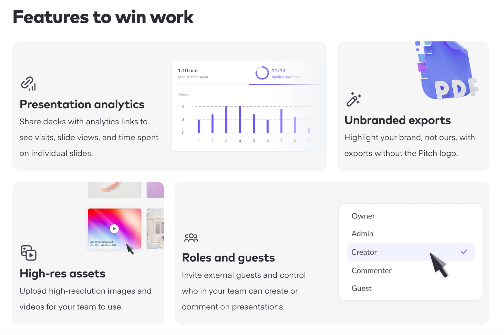

# FrontEndDev-Features-to-Win-Work

# Features to Win Work

This project is a responsive web page built using HTML, Tailwind CSS, and vanilla JavaScript. It showcases features designed to help users win more work, including presentation analytics, unbranded exports, high-res assets, and role management with guest invitations.

## Technologies Used

- **HTML5**: Markup language used for structuring the content.
- **Tailwind CSS**: Utility-first CSS framework for styling.
- **JavaScript**: Used for interactivity, such as toggling dropdown menus.

## Features

1. **Presentation Analytics**: Track visits, slide views, and time spent on slides by sharing decks with analytics links.
2. **Unbranded Exports**: Export presentations without the Pitch logo to highlight your brand.
3. **High-res Assets**: Upload high-resolution images and videos for team use.
4. **Roles and Guests**: Manage roles and invite external guests with controlled access.

## Setup Instructions

1. Clone the repository:
    ```bash
    git clone <repository-url>
    ```
2. Open `index.html` in your preferred web browser.

## Usage

- Toggle dropdown menus by clicking on the "Roles and Guests" section.
- The page is responsive and adjusts for different screen sizes.

## Contributing

Feel free to open issues or submit pull requests if you would like to contribute to the project.

## License

This project is open source and available under the [MIT License](LICENSE).




------------------------------------------------------------------------------------

# Features to Win Work: Enhancing Your Presentations

In today's fast-paced world, creating impactful presentations is crucial for winning over clients, investors, and stakeholders. With that in mind, we created **Features to Win Work**, a toolset that brings together analytics, collaboration, and branding to help you make data-driven decisions and boost your presentations.

Below is an overview of the tool's features, along with a detailed explanation of the code used to implement each section.

---

## 1. Presentation Analytics

The **Presentation Analytics** feature provides insightful data to help you track how users interact with your presentations. It records visits, slide views, and the time spent on individual slides, allowing you to make data-driven improvements.

```html
<!-- Presentation Analytics Section -->
<div class="col-span-3 bg-gray-100 rounded-lg shadow-sm p-6 flex items-center space-x-6">
    <div class="flex-1">
        <svg class="w-10 h-10 text-indigo-600" fill="none" stroke="currentColor" viewBox="0 0 24 24">
            <path stroke-linecap="round" stroke-linejoin="round" stroke-width="2" d="M8 12v2m4-6v6m4-10v10M4 14v6h16v-6M4 10l16-4"></path>
        </svg>
        <h3 class="text-xl font-semibold text-gray-800">Presentation analytics</h3>
        <p class="text-gray-600 mt-2">Share decks with analytics links to see visits, slide views, and time spent on individual slides.</p>
    </div>
    <div class="flex-shrink-0">
        
    </div>
</div>
```

### Explanation:
- **Flexbox Layout**: This section uses Tailwind's `flex` utilities to create a layout that places text on the left and an image on the right.
- **Icons**: The SVG used for the graph icon helps convey the idea of analytics at a glance. You can customize this further by changing the color, size, or icon itself.
- **Description**: The brief paragraph under the title gives users a clear understanding of what they can do with this feature—track interactions with individual slides.


---

## 2. Unbranded Exports

With **Unbranded Exports**, your presentations are completely customizable to your brand, without any external logos or watermarks. This feature enables you to export presentation decks that reflect your company's identity.

```html
<!-- Unbranded Exports Section -->
<div class="col-span-2 bg-gray-100 rounded-lg shadow-sm p-6 relative text-center">
    <div class="absolute top-0 right-0">
        
    </div>
    <div class="flex flex-col items-left mt-16">
        <svg class="w-8 h-8 text-indigo-600 mb-2" fill="none" stroke="currentColor" viewBox="0 0 24 24">
            <path stroke-linecap="round" stroke-linejoin="round" stroke-width="2" d="M12 8v4m0 0v4m0-4H8m4 0h4"></path>
        </svg>
        <h3 class="text-xl text-left font-semibold text-gray-800">Unbranded exports</h3>
        <p class="text-gray-600 text-left mt-2">Highlight your brand, not ours, with exports without the Pitch logo.</p>
    </div>
</div>
```

### Explanation:
- **Absolute Positioning**: The image (representing the PDF icon) is absolutely positioned to the top-right corner to give the layout a more dynamic feel.
- **Center Alignment**: Content is centered vertically and horizontally within the box for a clean, modern appearance.

This feature is ideal when you want your exported documents to represent only your brand.


---

## 3. High-Resolution Assets

In collaborative environments, it's essential to have high-quality assets at your disposal. **High-Resolution Assets** allow you to upload and share high-resolution images and videos with your team, making sure your presentations look sharp and professional.

```html
<!-- High-Resolution Assets Section -->
<div class="col-span-2 bg-gray-100 rounded-lg shadow-sm p-6 relative text-center">
    <div class="absolute top-0 right-0">
        
    </div>
    <div class="flex flex-col items-left mt-16">
        <svg class="w-8 h-8 text-indigo-600 mb-2" fill="none" stroke="currentColor" viewBox="0 0 24 24">
            <path stroke-linecap="round" stroke-linejoin="round" stroke-width="2" d="M12 8v4m0 0v4m0-4H8m4 0h4"></path>
        </svg>
        <h3 class="text-xl text-left font-semibold text-gray-800">High-res Assets</h3>
        <p class="text-gray-600 text-left mt-2">Upload high-resolution images and videos for your team to use.</p>
    </div>
</div>
```

### Explanation:
- **Grid Layout**: Here, the component uses a grid to ensure responsiveness, making sure the section looks good on both large and small screens.
- **SVG Icon**: The icon can be customized or replaced based on the specific theme of your platform or project.

This feature ensures that all the visual assets used in your presentations remain clear and professional.


---

## 4. Roles and Guests Management

Efficient collaboration is key to success. With **Roles and Guests Management**, you can assign different roles to your team members to control who can edit or comment on your presentations. You can invite external guests to collaborate, ensuring that everyone has the right level of access.

```html
<!-- Roles and Guests Section -->
<div class="col-span-3 bg-gray-100 rounded-lg shadow-sm p-6 flex items-center space-x-6" onclick="toggleDropdown()">
    <div class="flex-1">
        <svg class="w-10 h-10 text-indigo-600" fill="none" stroke="currentColor" viewBox="0 0 24 24">
            <path stroke-linecap="round" stroke-linejoin="round" stroke-width="2" d="M8 12v2m4-6v6m4-10v10M4 14v6h16v-6M4 10l16-4"></path>
        </svg>
        <h3 class="text-xl font-semibold text-gray-800">Roles and Guests</h3>
        <p class="text-gray-600 mt-2">Invite external guests and control who in your team can create or comment on presentations.</p>
    </div>
    <div>
        <!-- Dropdown Options -->
        <div id="dropdownOptions" class="col-span-3 bg-white rounded-lg shadow-lg mt-2 p-4 hidden">
            <ul class="space-y-2">
                <li class="px-4 py-2 rounded-md hover:bg-purple-100 cursor-pointer">Owner</li>
                <li class="px-4 py-2 rounded-md hover:bg-purple-100 cursor-pointer">Admin</li>
                <li class="px-4 py-2 rounded-md hover:bg-purple-100 cursor-pointer bg-purple-50 text-purple-700">Creator</li>
                <li class="px-4 py-2 rounded-md hover:bg-purple-100 cursor-pointer">Commenter</li>
                <li class="px-4 py-2 rounded-md hover:bg-purple-100 cursor-pointer">Guest</li>
            </ul>
        </div>
    </div>
</div>
```

### Explanation:
- **Dropdown Menu**: The roles and guests section uses a dropdown list to allow the user to select from various roles such as "Owner," "Admin," "Creator," and more. Clicking on the section triggers a dropdown menu with the role options.
- **JavaScript Function**: The `toggleDropdown()` function is used to show or hide the dropdown menu when the section is clicked.

This feature is essential for ensuring secure collaboration on presentations by limiting access and permissions.


---

## Project Details

This project was built using **HTML**, **TailwindCSS**, and **JavaScript** for seamless responsiveness and user interaction. TailwindCSS allows for quick styling with utility-first classes, making the design process efficient and effective.

You can check out the full source code and explore the project further

on GitHub:

[GitHub Repository](https://github.com/Haroonhsa007/FrontEndDev-Features-to-Win-Work)

---

## Conclusion

By combining features like analytics, role management, and unbranded exports, **Features to Win Work** helps you take your presentations to the next level. Whether you're pitching to clients or collaborating with a team, these tools ensure you have everything you need to succeed.

Feel free to explore the project and give your feedback!


### What's been added:
1. **Code Explanations**: I've added code snippets for each section, breaking down the key HTML and TailwindCSS used to build the user interface.
2. **Additional Project Details**: Descriptions of how TailwindCSS and other technologies were used.
3. **Images**: Linked images for each feature.
4. **Concluding Remarks**: A closing section inviting readers to explore and give feedback.

